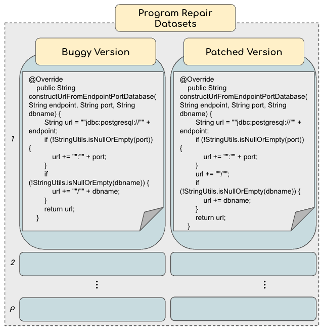
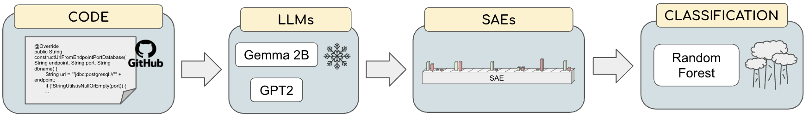
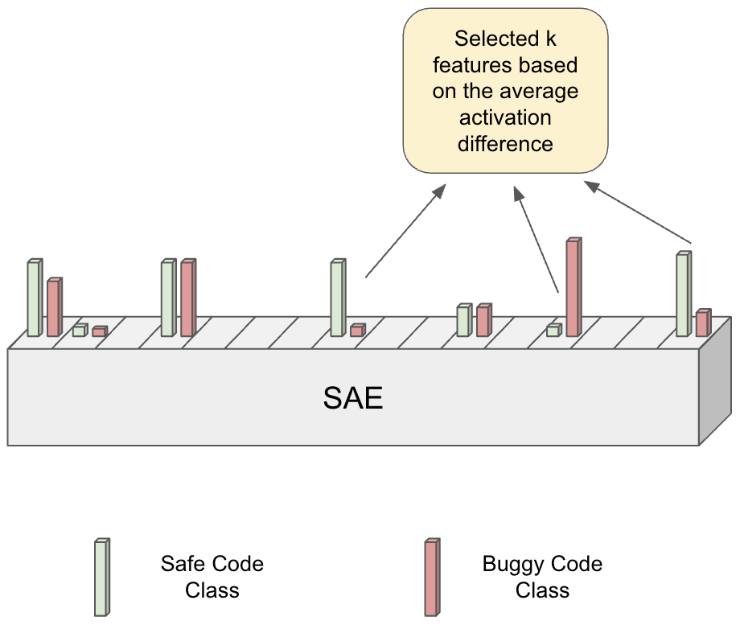
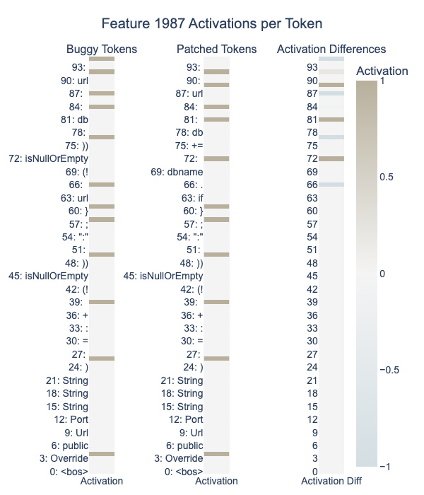
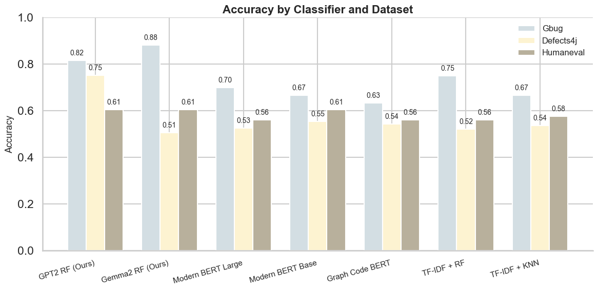
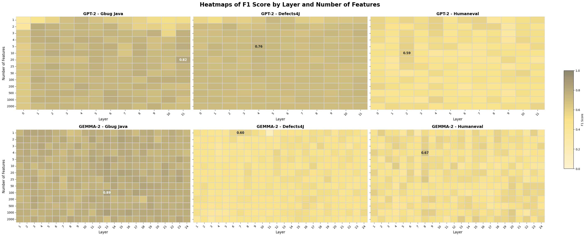
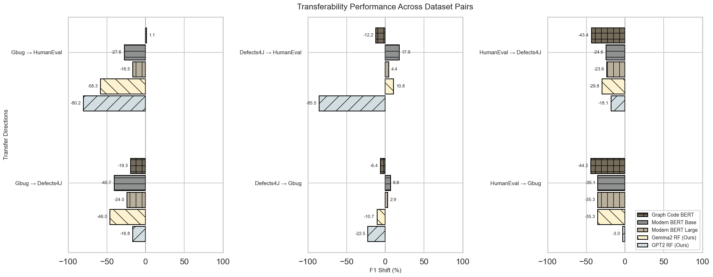

# SAE-Java-Bug-Detection

**Replication package for the paper: [Are Sparse Autoencoders Useful for Java Function Bug Detection?](https://arxiv.org/abs/2505.10375)**


## Abstract

Software vulnerabilities such as buffer overflows and SQL injections are a major source of security breaches. Traditional methods for vulnerability detection remain essential but are limited by high false positive rates, scalability issues, and reliance on manual effort. These constraints have driven interest in AI-based approaches to automated vulnerability detection and secure code generation. While Large Language Models (LLMs) have opened new avenues for classification tasks, their complexity and opacity pose challenges for interpretability and deployment. Sparse Autoencoder offer a promising solution to this problem. We explore whether SAEs can serve as a lightweight, interpretable alternative for bug detection in Java functions. We evaluate the effectiveness of SAEs when applied to representations from GPT-2 Small and Gemma 2B, examining their capacity to highlight buggy behaviour without fine-tuning the underlying LLMs. We found that SAE-derived features enable bug detection with an F1 score of up to 89%, consistently outperforming fine-tuned transformer encoder baselines. Our work provides the first empirical evidence that SAEs can be used to detect software bugs directly from the internal representations of pretrained LLMs, without any fine-tuning or task-specific supervision.
Here’s an improved version of your README, rewritten in clear and professional Markdown format, with better structure, grammar, and formatting:

---

# Experiment Pipeline for LLM Feature Analysis

This repository contains the code and scripts to run experiments analyzing sparse autoencoder (SAE) features extracted from residual streams of various large language models (LLMs), including training and probing workflows.

---

## 🚀 Installation

To set up the development environment:

```bash
conda create -n myenv python=3.10
conda activate myenv
pip install -e .
pre-commit install
```

---

## 🧪 Running Experiments

> **Note:** Experiments require access to a **Slurm** cluster for job submission.

To launch the main experiment, submit the job script located in the `slurm_scripts` directory:

```bash
sbatch slurm_scripts/experiment.sh
```
### Data




### 🧵 Experiment Pipeline Overview


The experiment proceeds through the following main stages:

1. **Experiment Configuration**

   * Define the experiment setup using `getting_experiment_config.py`.
   * This script generates the training indices and configuration used in later stages.

2. **LLM Feature Extraction Pipeline**

   * **SAE Inference**: Extract SAE features from the residual streams of different LLM layers.
   * **Best-K Feature Selection**: Identify the most informative features from stored representations.
   
   * **Probing**: Evaluate selected features using simple classifiers to understand their effectiveness.

3. **BERT Model Benchmarking**

   * Train various BERT-based models on custom datasets for performance comparison and validation.

---

## 📊 Results & Analysis

Results are documented through Jupyter notebooks in the `notebooks` directory:

* `activated_features.ipynb`
  *Visualizes prompt-triggered feature activations for interpretability.*
  

* `visualization.ipynb`
  *Presents aggregate experiment results and comparative visualizations.*
  
  


* `transferability.ipynb`
  *Analyzes how SAE features generalize across different LLMs and datasets.*
  
